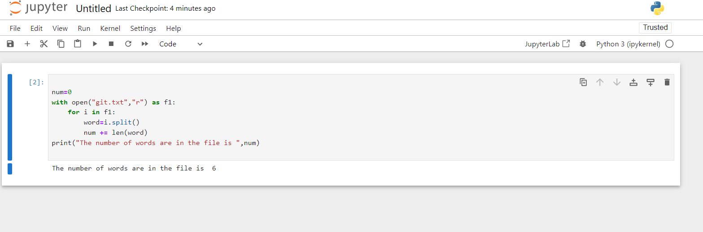
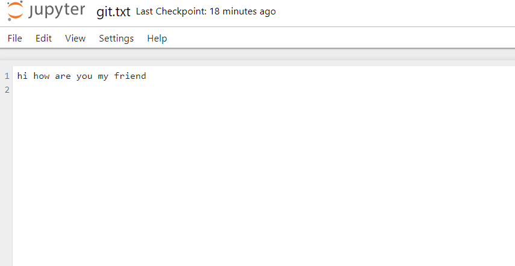

# Word-count
## AIM:
To write a python program for getting the word count from a text.
## EQUIPEMENT'S REQUIRED: 
PC
Anaconda - Python 3.7
## ALGORITHM: 
### Step 1:
Open the file in read mode and handle it in text mode.
### Step 2: 
 Read the text using read() function.
### Step 3: 
Split the text using space separator .we assume that words in a sentence are separated by a space character.
### Step 4:  
The length of the split list should equal the number of words in the text file.
### Step 5: 
You can refine the count by clearing the string prior splitting or validating the words after splitting.
### Step 6: 
End the program with using print command.
## PROGRAM:
```
program for getting the word count from a text.
Developed by: MARELLA HASINI
Register Number : 23012757
num=0
with open("git.txt","r") as f1:
     for i in split()
         word=i.split()
         num += len(word)
print("The number of words are in the file is",num)
```
### OUTPUT:



## RESULT:
Thus the program is written to find the word count from a text.
